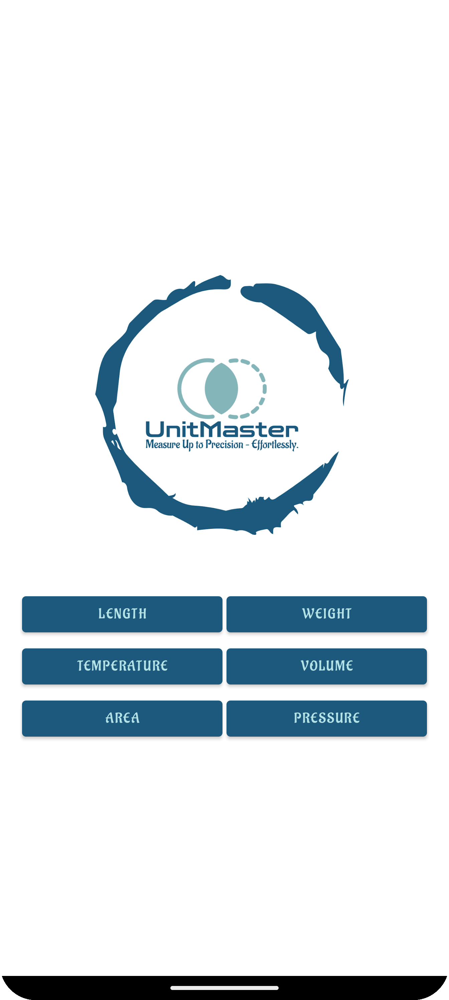

# Unit Converter App

A user-friendly Unit Converter Android app that helps convert various units of measurement such as length, weight, volume, area, temperature, and pressure. The app provides quick and accurate conversions with a simple interface.

## Features

- Convert between units of length, weight, volume, area, temperature, and pressure
- Simple and intuitive calculator-like interface for input
- Support for additional units like Millimeter, Yard, Pint, Cup, Square Mile, PSI
- Select units from dropdown menus (Spinners)

## Screenshots

### UnitMaster

### Main Screen

### Conversion Screen

